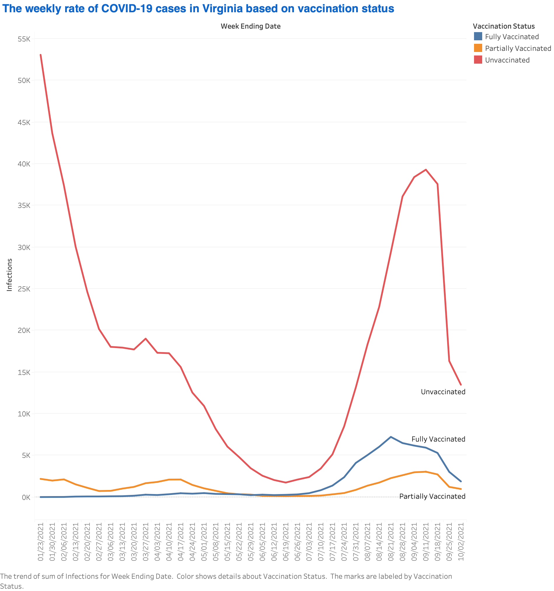
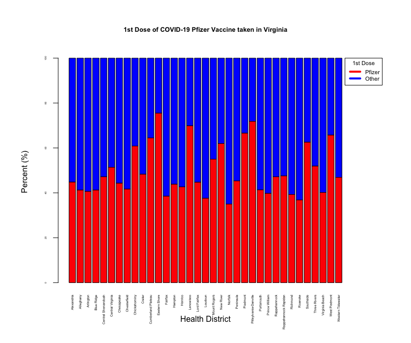
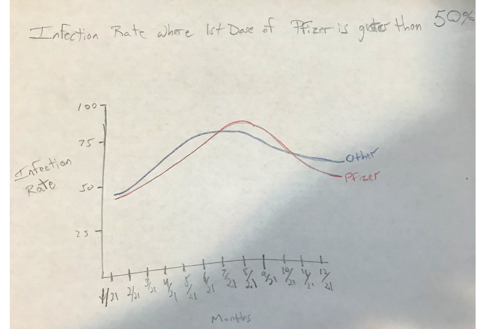
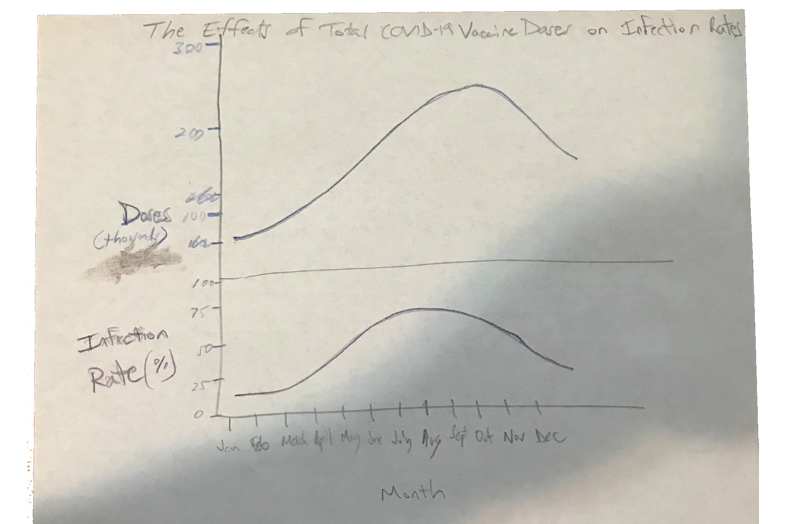

================

### Part 1

**Directions**

*Use dataset 1 to create a chart to answer the question, "How has the weekly rate of COVID-19 cases in Virginia changed over time based on vaccination status?".*

**Normalization**

After downloading dataset 1, I used Excel to clean and normalize the data.The first thing I did was add three columns labeled "Infections per 100K", "Hospitalizations per 100K", "Deaths per 100K" and applied the equation:

    rate_per_100k = (cases / population_denominator) * 100000

 The decimal places for each new column was set to "0" in order to present the data to the user in a more simplified manner.
 
**Sort**
 
 Next, I sorted the "Week Ending Date" column by date in ascending order to show the earliest cases first starting 1/23/2021.
 
**Tableau**

I clicked on "Sheet 2" and imported the Excel spreadsheet into Tableau. I also checked the box labeled "Data Interpreter" which updated my data to include my original sorting I made in Excel.

**Visualization Idiom**

I chose to use a line chart because the attributes were quantitative (infections) and ordered (date). The idiom needs to show trends scaled over the course of a year which is best visualized by a line chart. The marks are the dose count which were connected.

### Part 2

**Directions**

*Use dataset 2 to create a chart to answer the question, "For each health district in Virginia, what proportion of all 1st doses were of the Pfizer vaccine?".*

**Cleaning Data**

I began by opening dataset 2 in Excel. I first sorted the column labeled "Vaccine.Manufacture" in order to calculate the percentage of doses used by each manufacturer in its respective city. I removed the "health districts" labeled "Out of State" and "Not Reported" by highlighting the rows, right-clicking the dropdown and selecting "Delete rows". I realized that I would need to do a great deal of grouping in order to determine percentages of the first dose of Pfizer by city so I saved the dataset as a .csv file and imported it into OpenRefine. First, I filtered by Dose number (1) since that is the only dose were considered with measuring. Next, I created a facet for Vaccine Manufacturer and was shown the total doses by Manufacturer. I then added all the doses to get Total Doses and divided the total for each Vaccine Manufacturer by the Total Dose. I then imported dataset 2 into R Studio for further cleaning. I sorted the column labeled "Health District" in ascending order. I decided to sort "Health District" since the user can quickly locate their chosen city in a short amount of time. First, the Vaccine Manufacturer was grouped together as "Other" for any Vaccine that was not Pfizer. Next, all "Health.Districts" cells that had the same name were merged together leaving two cells per "Health.District"; one for "Pfizer" and one for "Other". I also included the "Percent" column which is the percent of Pfizer per total doses administered in that region as well as "Other".

**Calculating % of Pfizer Dose by City**

I added a column labeled "Percent" and calculated total doses for each city by "Vaccine.Manufacturer" (Pfizer or Other). The calculation was done by filtering for Dose "1" and taking the sum of Manufacturer doses divided by the sum of total doses in its respective "Health.District". Adding the Percent of "Pfizer and"Other" added to 1.00 or 100%.

**Visualization Idiom**

I chose to use a normalized stacked bar chart since I had one quantitative attribute (percentage) and two categorical attributes (Health District and Vaccine.Manufactured). I preferred the Health Districts on the x-axis since this attribute has several dozen categories and the user is better able to reference districts alphabetically when displayed 90 degrees on the horizon. I used color hue of pure red and pure blue as it clearly differentiates between Pfizer and Other. I had to make a decision which axis I was going to place the Health Districts. Although I'd prefer to have them as a list on the Y-axis, I find that the bars themselves are better viewed vertically. 

### Part 3

**Directions**

*Propose two questions that require data from dataset 1 and dataset 2 to be combined to answer. Describe what data manipulation would need to be done to answer each question. Sketch a chart that could be used the answer each question. Justify your visualization idiom choice.*

**Questions**

Question 1: Did the rate of infections decrease at a greater rate in regions where the 1st Dose of the Pfizer vaccine was greater than 50%?

**Data Manipulation** 

In order to answer Question 1, I would refer to dataset 1 and include the rate of infections along with the regions where they occurred. In dataset 2, I would filter every Health District where the 1st Dose of Pfizer was greater than 50% and then determine which Region that particular health district is in. On the x-axis, I would include a timeline by converting "Week Ending Date"and "Administration.Date" into months and year. Both infection rate for Pfizer and Other is shown.

**Sketch**

**Visialization Idiom Choice**

I chose to use a line chart since I there is one quantitative value attribute (infection rate) and one ordered value attribute (date). Since the general public is more than likely the user of the idiom, a common chart such as a line chart is always easier for a random person to interpret.

Question 2: What effects did the quantity of total administered vaccines of any brand have on the average infection rate in the state of Virginia?

**Data Manipulation**

In order to answer Question 2, I would refer to dataset 1 and include the "Week Ending Date" column, the "Infections per 100,000" column and from dataset 2 I would include the "Vaccine.Doses.Administered.Count" column along with "Administration.Date" column. Next, I would convert both "Week Ending Date" and "Administration.Date" into months. For example, if the date was 7/23/2021, it would be converted to "July". After doing so, I would merge all cells with the same month together and making sure the sum of "Vaccine.Doses.Administered.Count" was summed by month as well.

**Sketch**

**Visialization Idiom Choice**

I chose to use a stacked line chart as my idiom since the quantitative data were on two different scales. I also applied the "eye beats memory" principle as both infection rate and dose are better compared on the same idiom.

## References

* R Charts, https://r-charts.com/part-whole/stacked-bar-chart-ggplot2/
* Rotate X -axis Labels, https://stackoverflow.com/questions/1330989/rotating-and-spacing-axis-labels-in-ggplot2
* Add Color to Bars, https://www.r-graph-gallery.com/209-the-options-of-barplot.html
* Add Legend, https://r-coder.com/add-legend-r/
* Move Legend Outside Plot, https://www.statology.org/legend-outside-plot-r/
* Title and Axis Labels, https://www.dummies.com/programming/r/how-to-add-titles-and-axis-labels-to-a-plot-in-r/
* Font Size, https://stackoverflow.com/questions/36842119/change-font-size-in-legend
* Barplot Title, http://www.sthda.com/english/wiki/add-titles-to-a-plot-in-r-software

